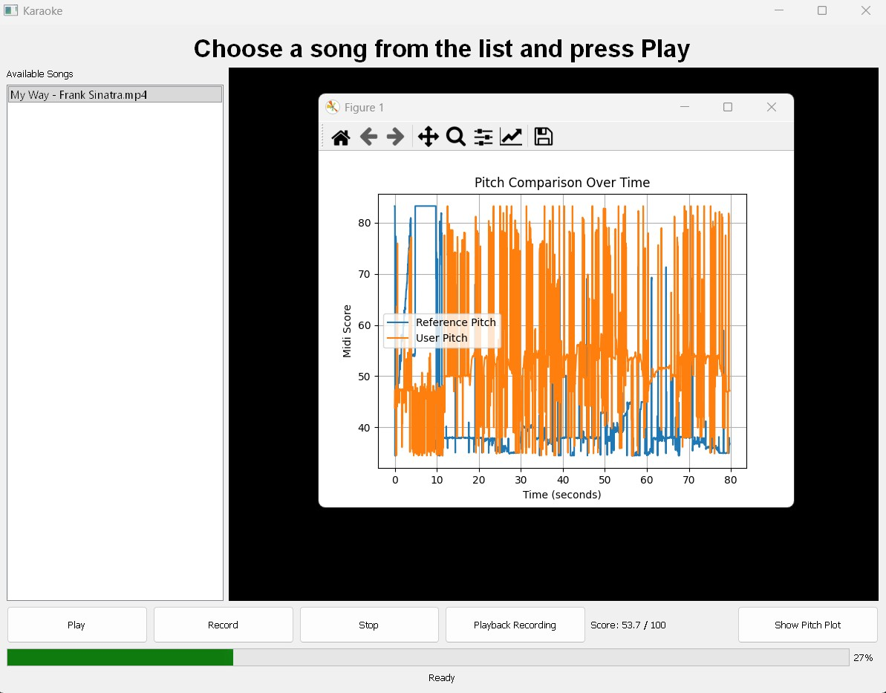

# Pitch-Detecting Karaoke Machine
By Thanadetch (Detch) Mateedunsatits and Liam Bennicoff
## Description
It uses a pitch detection algorithm to score karaoke singing. It requires .wav or .mp4 files from the user, specifically covering the vocal tracks of the song to test (reference audio) and the user's singing (user audio). It will score them from 50 to 100, purely on pitch. It uses the MIDI scale and has two levels of sensitivity, with one meant for beginners and another for those who are confident at singing. The sensitivity of the model and scoring system can be changed in karaoke_scorer.py. It also has a GUI to browse all tracks loaded into the program, as well as built-in recording, scoring, MIDI score over time, and playback features. 

## Features

1. Play, to play the video file. 
2. Record, to play and record the video file.
3. Stop/Pause, to stop the video file. The button shows up as pause if the video is already being played.
4. Playback, to play back the user's singing overlayed on the musical back track.
5. Score, displays a score from 50 to 100 depending on how well you sung.
6. Waveform viewer, display a waveform of the user's singing as well as the vocal track.

## Installation Instructions
1. It is recommened to use Python 3.13.0 as that was the version the development team used

2. Download all require libraries via `pip install -r requirements.txt`

3. Check requirements are fufilled by heading over to the `tests` folders and running `import_check.py`

4. Download all the files from the repository.

## Getting Started and file requirements (PLEASE READ!)

When starting your first run of the `main.py` you will encounter that there are no songs in the list. The user can add their own songs into the application through the `Songs` folder. The songs should be `.mp4` format for the system to work best. Non-mp4 files will not show up on the left tab.

1. Getting your first audiofile. The user may find it helpful to head to websites like `https://media.ytmp3.gg/youtube-to-mp4-converter` to convert the song they want to mp4 and put it into the folder to get it started. The YouTube channel SingKing or other Karaoke song providers on the internt are good places to start.
2. Setting up your song list in `Songs` and try running `main.py` again

## Recording your first recording and Your first Score

1. Select a song and click the record button
2. Once it has finish, WAIT WAIT WAIT. The program will freeze on you as it tries to compute the extremely intensive probalistic YIN process to get the score. Be patient please! It may take over a minute at times. This is not a bug. Exercise patience please.
3. Click the waveform button if you want to see the waveform. The calculation used a probalistic YIN model which is far more resistant to spikes than the one shown on the graph but produces sparser data points; hence, we've used the YIN model to produce more useful visualization. Both models should produce similar results and it's possible to override the scoring into a YIN through the functions in `Model.py`

## Unit Testing
### Karaoke Scorer and Scoring system
- Download itim_perfect.wav (sample user audio) needed to test. It is located in the `tests` folder
- Find an acapella cover of Perfect by Ed Sheeran and convert it to a .wav file using the method mentioned above.
- Rename the file to PerfectVocals or adjust the filename in karaoke_scorer_test.py to align with whatever filename you chose
- Run the karaoke_scorer_test file
- To test out the system more, the user can find and record a variety of test files aganist a song's vocal reference files.
### Main MVC tests
- Located in the tests folder
- Adjust the filepath in the media_test files to adjust for the various songs the user wants to test out.

### Known issues
1. There seems to be strong ringing behavior when using the Olin laptop microphone specifically. It seems to be a recorder specific issue as the testing shows that a clear audio recording from another source could yield scores as high as 94. 